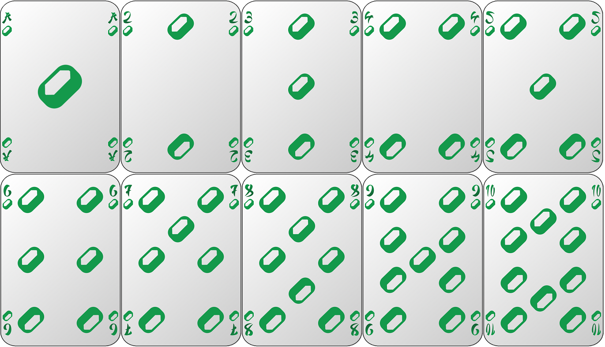
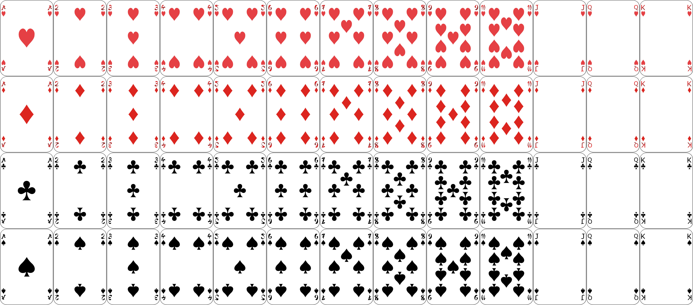
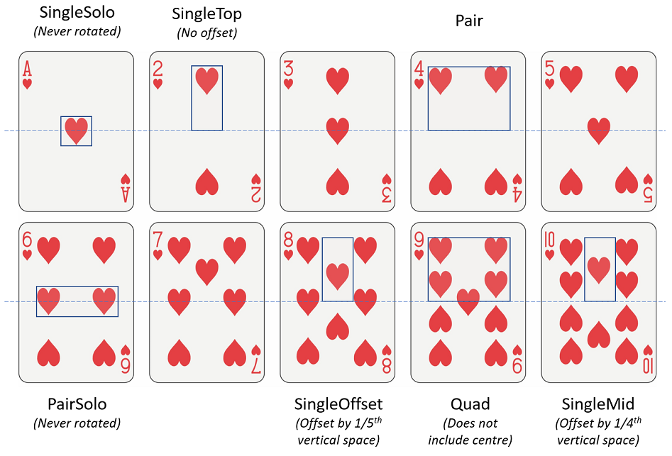

# card-gen

A tool to generate images of Poker playing cards when given the component art elements as input. 


## Description

Required inputs are:
* Image of the card face (the background onto which other elements will be composed)
* Images for each suit (e.g. hearts, diamonds, spades, clubs)
* Images for each number of each suit

Output:
* 1 file per suit per card ("Ace of Diamonds", "8 of Clubs")
* 1 summary file with all cards combined

## Gallery




## Running

* Clone repository
* Edit example files as you see fit
* Modify generate.py `Config` class to set dimensions appropriate to your source images
* Run:
```
py generate.py
```
* Files are output to `bin\*.png`

## How it works
The numerical poker cards can be defined by building 7 arrangements of the suit symbols, then composing these with each other or mirrored copies of themselves about the centre line of symmetry:



## Version History

* 1
    * Initial Release


## License

Repository licensed under MIT, see [LICENSE](LICENSE) for details. However if you use the Software commercially I'd really appreciate you crediting me (link to github or credited by name).
