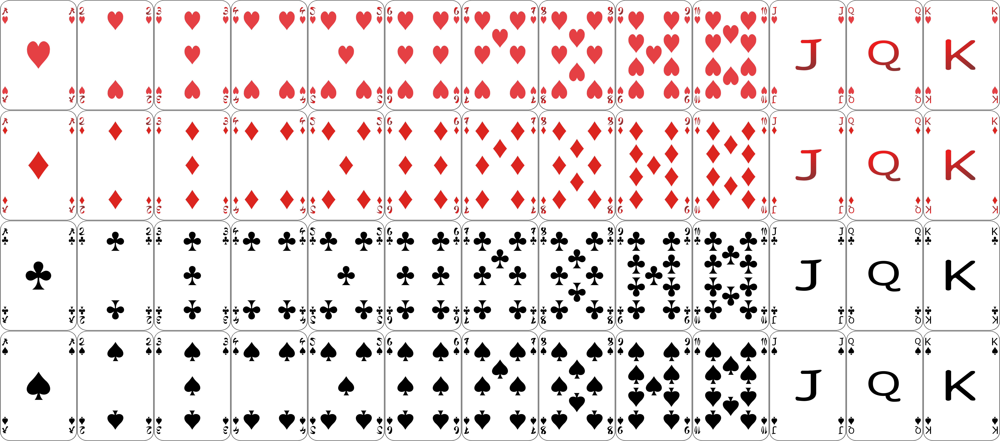
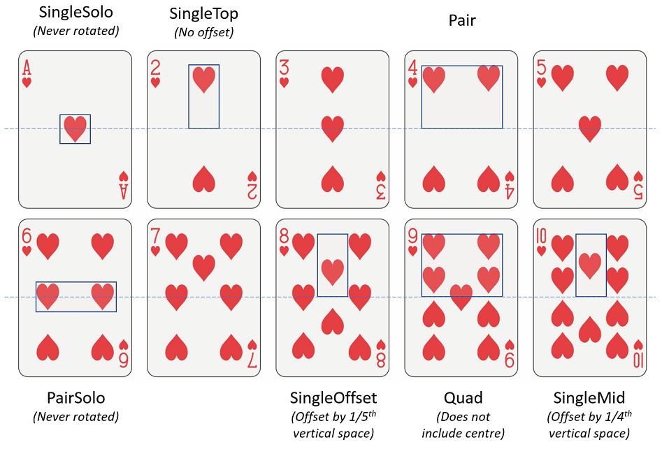

# card-gen
A tool to generate images of Poker playing cards when given the component art elements (suits, background) as input. 

## Description

Required inputs are:
* Image of the card face (the background onto which other elements will be composed)
* Images for each suit (e.g. hearts, diamonds, spades, clubs)
* Images for each number of each suit

Output:
* 1 file per suit per card ("Ace of Diamonds", "8 of Clubs")
* 1 summary file with all cards combined

## Gallery



## Installation
1. Install [imageMagick](https://docs.wand-py.org/en/0.2.4/guide/install.html#installation) and add to your path.
2. Install the application:

### Using pip (recommended)
```bash
# Clone repository
git clone https://github.com/rjfalconer/card-gen.git
cd card-gen

# Install package in development mode
pip install -e .

# Or install with development dependencies
pip install -e .[dev]
```

### Manual installation
```bash
# Clone repository  
git clone https://github.com/rjfalconer/card-gen.git
cd card-gen

# Install dependencies
pip install -r requirements.txt

# For development
pip install -r requirements-dev.txt
```

## Running

### Using the new pythonic API

```python
from card_gen import CardGenerator, Config

# Use default configuration
generator = CardGenerator()
generator.generate_cards()

# Or customise configuration
config = Config(
    card_values=["A", "K", "Q", "J"],  # Only generate face cards
    total_suits=2,  # Only 2 suits
    ace_size=300   # Larger ace
)
generator = CardGenerator(config)
generator.generate_cards("my_output_dir")
```

### Using the command line

```bash
# Using the new script
python generate.py
```

## How it works
The numerical poker cards can be defined by building 7 arrangements of the suit symbols, then composing these with each other or mirrored copies of themselves about the centre line of symmetry:



## Development

### Running Tests
```bash
# Run all tests
pytest

# Run with coverage
pytest --cov=card_gen

# Run specific test file
pytest tests/test_config.py -v
```

### Code Quality
```bash
# Format code
black card_gen/ tests/

# Lint code
flake8 card_gen/ tests/

# Type checking
mypy card_gen/
```

## API Reference

### Config Class
The `Config` class allows you to customize card generation:

```python
config = Config(
    card_values=["A", "2", "3", "4", "5", "6", "7", "8", "9", "10", "J", "Q", "K"],
    total_suits=4,
    ace_size=250,
    frame_horizontal_margin=100,
    frame_vertical_margin=100,
    support_left_handed=True
)
```

### CardGenerator Class
The main class for generating cards:

```python
generator = CardGenerator(config)
generator.generate_cards(output_dir="bin")
```

## Version History

* 2.0.0
    * Added proper class structure with CardGenerator and Config classes
    * Introduced unit tests with pytest
    * Implemented type hints
    * Added proper error handling and validation
    * Upgraded to latest package versions
    * Added development tools (black, flake8, mypy, pytest-cov)
* 1.0.0
    * Initial Release

## License

Repository licensed under MIT, see [LICENSE](LICENSE) for details. However in the unlikely event that you use the Software commercially, I'd really appreciate you crediting me (link to github or credited by name).
